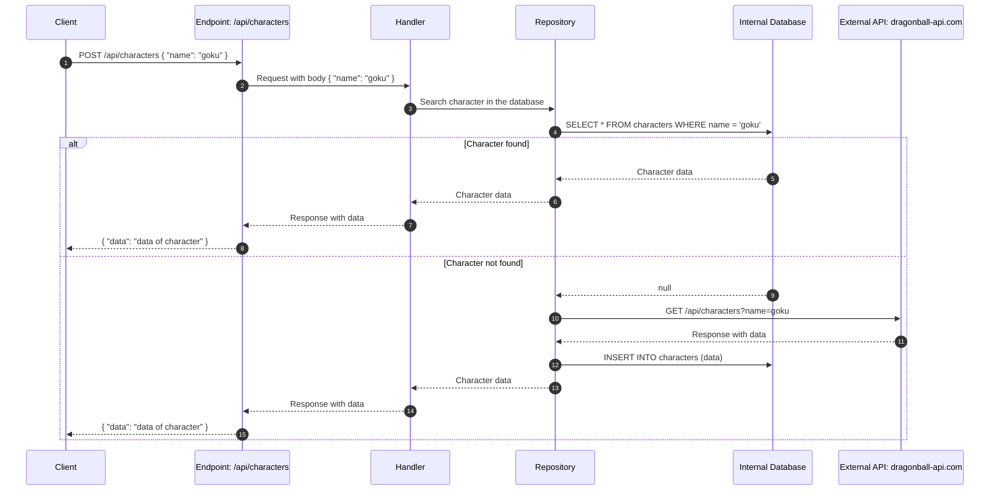
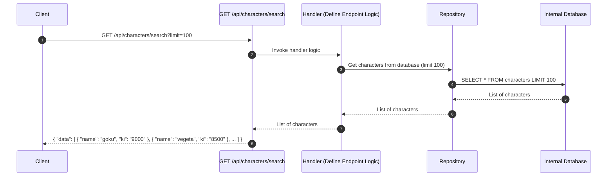
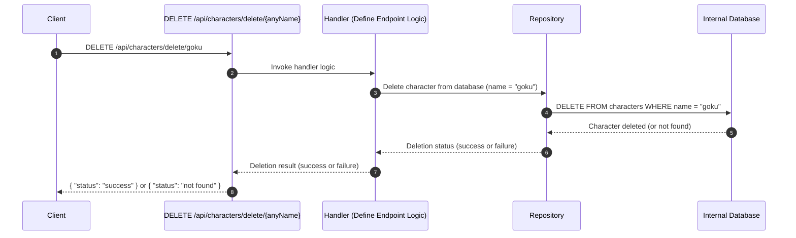

# Dragon ball

This app search and save characters of Dragon ball from external API https://web.dragonball-api.com/

## How to run application

Run docker mode
```sh
docker-compose up -d --build
```

Run unit test:
```sh
# Execute test
go test -timeout 30m -coverprofile=coverage.out -coverpkg=./... ./src/...
# Generate html of coverage
go tool cover -html coverage.out -o coverage.html
# Getting % of coverage
go tool cover -func=coverage.out | awk 'NR>1{print $3}' | awk '{sum+=$1} END {print sum/NR}'
```

Run lint:
```sh
go vet ./...
golangci-lint run --timeout=30m
# remember install libraries of linter in local
go install github.com/golangci/golangci-lint/cmd/golangci-lint@latest
```

## Documentation 

3 endpoints were made, which are:
- POST: http://localhost:8080/api/characters/
- GET: http://localhost:8080/api/characters/search
- DELETE: http://localhost:8080/api/characters/delete/anyName

PD: In the file ./conf/dragon-ball.postman_collection.json is the Postman collection with all the endpoints


#### Below will be a brief explanation of the behavior, an example and the sequence diagram of each endpoint.

1. POST: http://localhost:8080/api/characters/

__Explanation__

The POST /api/characters endpoint retrieves character information by name. It first queries the internal database to check if the information already exists. If not found, it sends a request to an external public API, retrieves the data, stores it in the internal database, and then returns the information to the client. This design prioritizes efficiency by using local data when available and ensures persistence for future requests. The response is consistent regardless of the data source.

__Example__

```sh
curl -X POST http://localhost:8080/api/characters/ \
-H "Content-Type: application/json" \
-d '{
    "name": "goku"
}'
```

__Sequence Diagram__



2. GET: http://localhost:8080/api/characters/search

__Explanation__

The GET /api/characters/search endpoint allows the client to retrieve a list of stored character data. It queries the internal database for character information and returns the results to the client. The client can also specify a limit on the number of characters returned (e.g., ?limit=100).

__Example__

```sh
curl -X GET "http://localhost:8080/api/characters/search?limit=100"
```

__Sequence Diagram__



3. DELETE: http://localhost:8080/api/characters/delete/anyName

__Explanation__

The DELETE /api/characters/delete/{anyName} endpoint allows the client to delete a character from the database by providing the character's name in the URL path (anyName). The request triggers a handler, which invokes the repository to remove the character's data from the internal database if it exists. The operation ensures that the character is deleted only if found.

__Example__

```sh
curl -X DELETE "http://localhost:8080/api/characters/delete/goku"
```

__Sequence Diagram__


